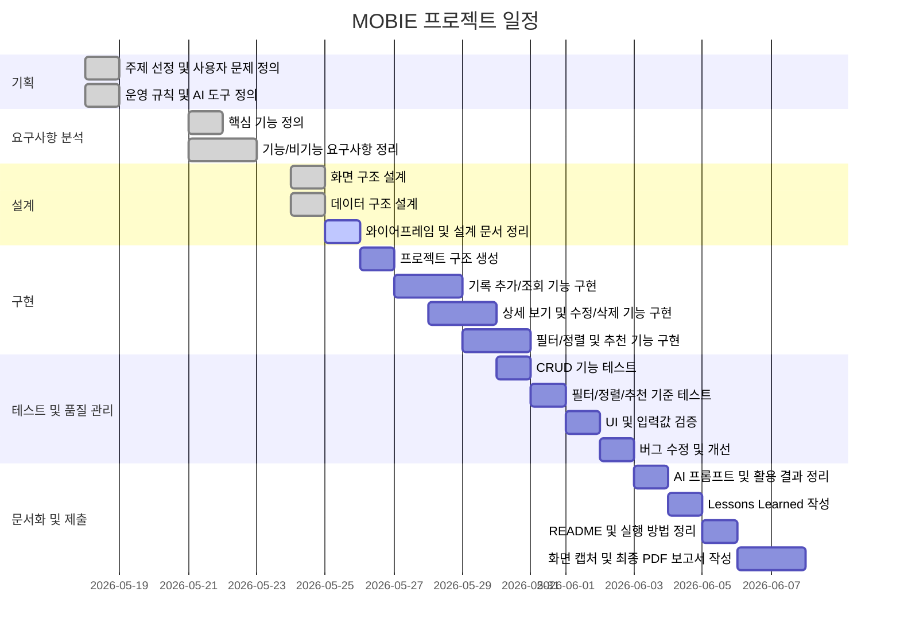

# MOBIE 프로젝트 간트차트

## 1. 간트차트 작성 목적

본 문서는 MOBIE 프로젝트의 일정 계획과 실제 진행 흐름을 시각적으로 정리하기 위해 작성하였다.  
과제에서 요구하는 “착수 시점부터 제출 전까지 주기적인 토의와 지속적인 작업이 이루어졌는가”를 보여주는 증빙 자료로 활용한다.

## 2. 일정 개요

| 기간 | 단계 | 주요 작업 | 관련 산출물 |
| --- | --- | --- | --- |
| 2026-05-18 | 기획 | 주제 선정, 사용자 문제 정의, 운영 규칙 설정 | 1차 회의록, `groundrules.md` |
| 2026-05-21 ~ 2026-05-22 | 요구사항 분석 | 핵심 기능, 기능/비기능 요구사항 정리 | 2차 회의록, `requirements.md` |
| 2026-05-24 ~ 2026-05-25 | 설계 | 화면 구조, 데이터 구조, 와이어프레임 작성 | 3차 회의록, `design.md` |
| 2026-05-26 ~ 2026-05-29 | 구현 | CRUD, 필터링, 정렬, 추천 기능 구현 | 소스 코드 |
| 2026-05-30 ~ 2026-06-02 | 테스트 및 품질 관리 | 기능 테스트, 입력값 검증, 버그 수정 | `test-report.md`, 커밋 기록 |
| 2026-06-03 ~ 2026-06-05 | 문서화 | AI 활용 기록, Lessons Learned, README 정리 | `ai-prompts.md`, `lessons-learned.md`, `README.md` |
| 2026-06-06 ~ 2026-06-07 | 제출 준비 | 화면 캡처, 최종 PDF 보고서 작성 | `screenshots/`, `final-report.pdf` |

## 3. 간트차트

## 4. 일정 관리 기준

- 회의는 주 2회 이상 진행하고, 회의록은 날짜별로 저장한다.
- 각 단계의 산출물은 GitHub 저장소에 커밋하여 작업 이력을 남긴다.
- 구현 단계 이후에는 기능 추가보다 테스트와 품질 개선을 우선한다.
- 최종 제출 전에는 화면 캡처, 보고서, README, GitHub 증빙 자료가 모두 연결되는지 확인한다.

